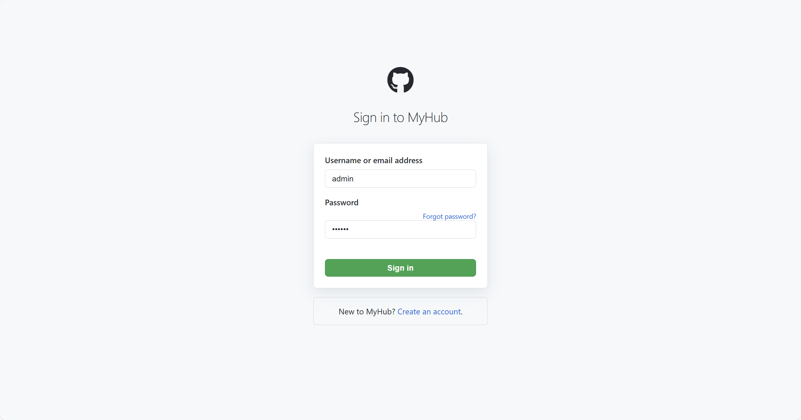
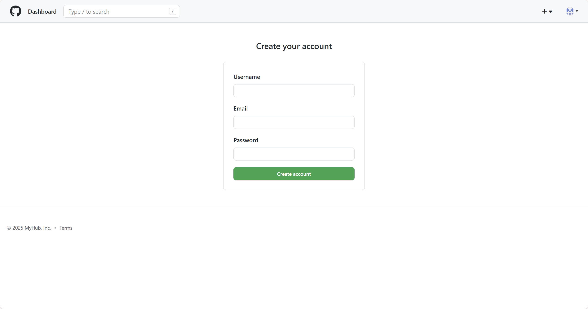
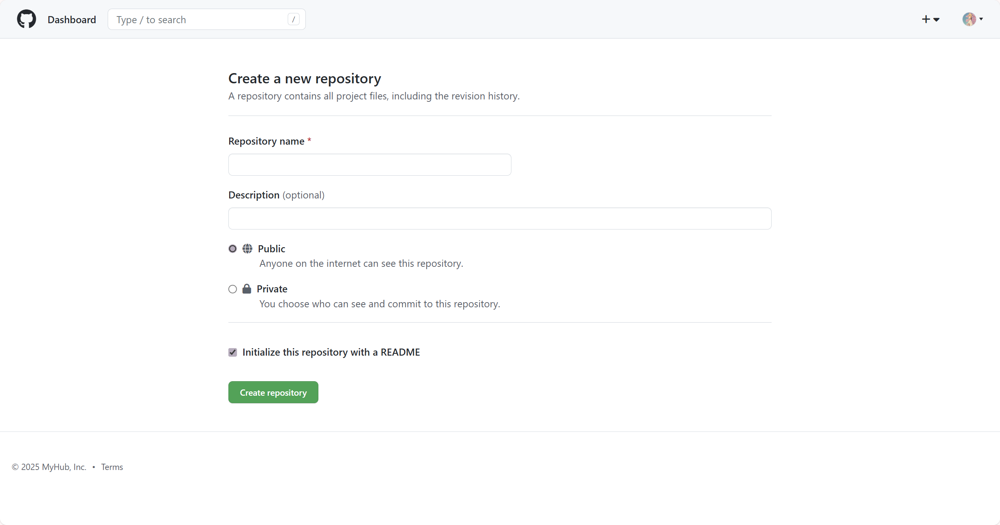
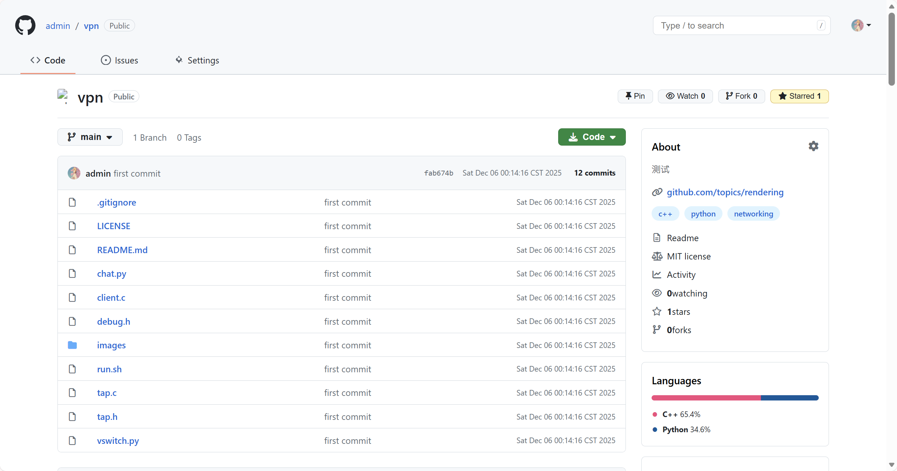
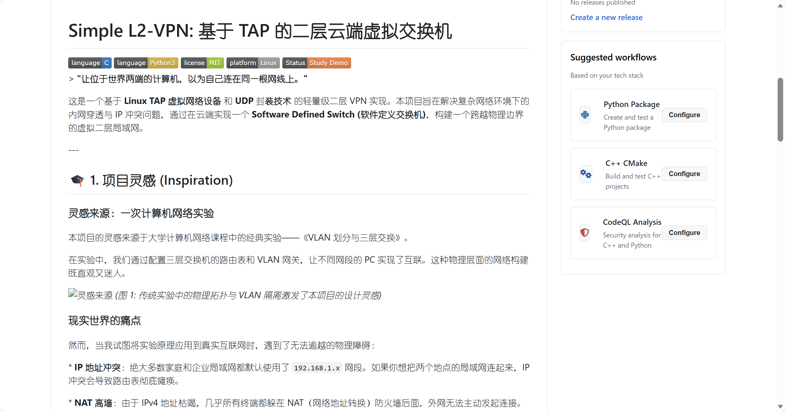
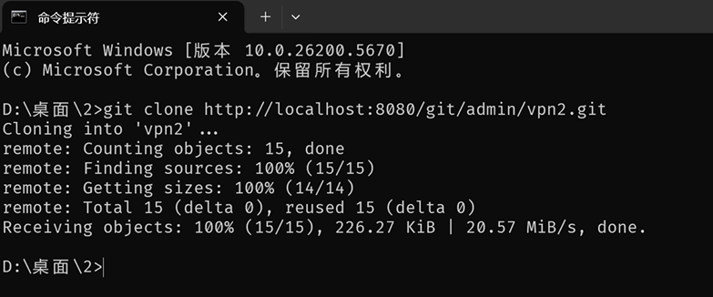
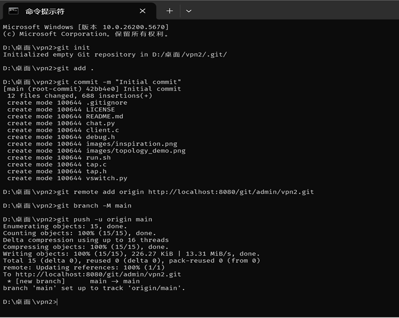
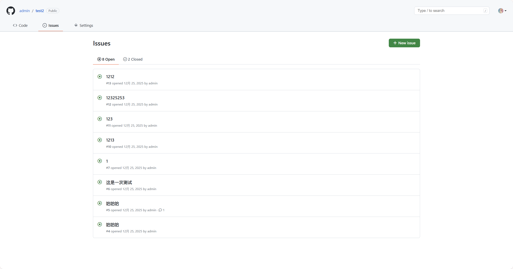
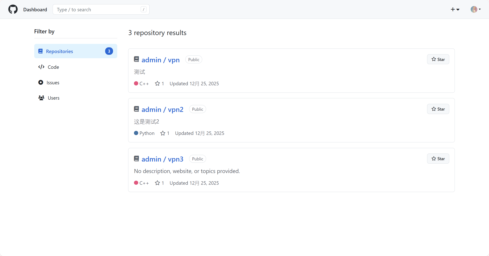
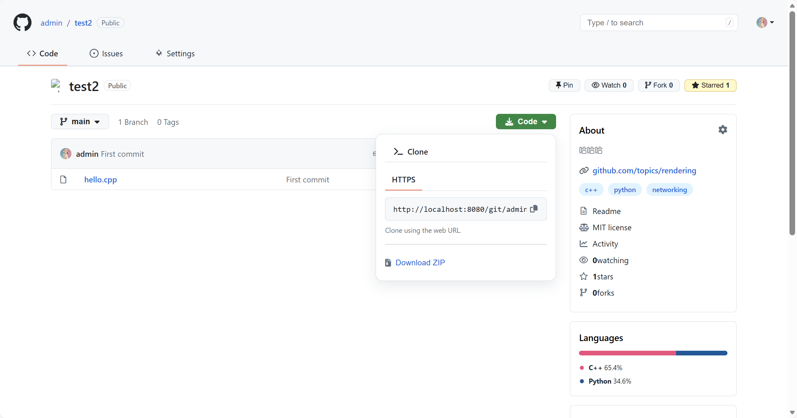

# MyHub

## 项目简介
一个 GitHub 风格的代码托管平台，使用 Java 开发。
MyHub 是一个功能完整的代码托管系统，提供用户管理、仓库管理、代码浏览、Issue 跟踪等核心功能。支持 Git 协议操作，集成 AI 助手，提供代码高亮、Markdown 渲染、贡献统计等功能。

## 技术栈

| 类别 | 技术 |
| --- | --- |
| 后端 | Java 8+, Servlet, JSP, Maven |
| 前端 | HTML5, CSS3, JavaScript, Primer CSS, Font Awesome, Highlight.js |
| 数据库 | MySQL 5.7+ |
| 其他 | JGit, Log4j2, Apache Commons, Deepseek API |

## 项目结构

```
MyHub/
├── .idea/                    # IntelliJ IDEA 配置
├── .mvn/                     # Maven 配置
├── image/                    # 示例图片
├── sql/                      # 数据库脚本
│   └── init.sql
├── src/
│   └── main/
│       ├── java/com/example/myhub/
│       │   ├── bean/         # 实体类
│       │   ├── dao/          # 数据访问层
│       │   ├── service/      # 业务逻辑层
│       │   ├── servlet/      # 控制层
│       │   ├── filter/       # 过滤器
│       │   ├── util/         # 工具类
│       │   └── dto/          # 数据传输对象
│       ├── resources/        # 配置文件
│       └── webapp/
│           ├── jsp/          # JSP 页面
│           ├── css/          # 样式文件
│           └── WEB-INF/
├── target/                   # 编译输出目录
├── .gitignore                # Git 忽略文件
├── Myhub.iml                 # IntelliJ IDEA 项目文件
├── pom.xml                   # Maven 配置
└── README.md                 # 项目说明
```

## 功能特性

### 用户系统
- 支持用户注册与登录认证，确保账户安全
- 完整的个人资料管理功能，包括用户名、邮箱、个人简介和头像上传
- 用户档案页面展示用户概览、仓库列表、Star列表和贡献统计

<div align="center">
  
  <p>用户登录界面</p>
</div>

<div align="center">
  
  <p>用户注册界面</p>
</div>

### 仓库管理
- 支持创建新仓库，可选择初始化README文件
- 提供删除仓库功能，方便管理不需要的项目
- 完整的仓库设置选项，包括重命名、修改描述和切换公开/私有状态
- 灵活的权限控制，公开仓库任何人可见，私有仓库仅所有者可访问

<div align="center">
  
  <p>创建新仓库界面</p>
</div>

<div align="center">
  
  <p>仓库详情页面</p>
</div>

### 代码浏览
- 直观的文件树浏览界面，轻松查看仓库的目录结构
- 支持文件内容查看和代码高亮显示，提升代码阅读体验
- 自动渲染Markdown文件为HTML，美观展示项目文档
- 灵活的分支切换与管理，支持查看不同分支的代码

<div align="center">
  
  <p>代码高亮显示效果</p>
</div>

<div align="center">
  
  <p>Markdown文件渲染效果</p>
</div>

### Git 功能
- 支持Git克隆操作，用户可以通过Git命令行工具克隆仓库到本地进行开发
- 支持Git推送操作，用户可以将本地修改推送到远程仓库
- 提供提交历史查看功能，展示每次提交的详细信息和作者信息
- 完整的分支管理功能，支持查看和切换不同的分支

<div align="center">
  
  <p>Git克隆操作</p>
</div>

<div align="center">
  
  <p>Git协议支持</p>
</div>

### Issue 跟踪
- 支持创建Issue来报告问题或提出建议
- 完整的Issue列表展示，可按开放/已关闭状态筛选
- 详细的Issue详情页面，支持用户评论和讨论
- 灵活的Issue状态管理，支持开放和关闭Issue

<div align="center">
  
  <p>Issue评论讨论界面</p>
</div>

### 社交功能
- 用户可以给喜欢的仓库点Star，收藏感兴趣的项目
- 支持取消Star操作，灵活管理收藏列表
- 实时显示仓库的Star计数，了解项目的受欢迎程度

### 搜索与发现
- 强大的仓库搜索功能，快速找到感兴趣的项目
- 公开仓库浏览，发现社区中的优质项目

<div align="center">
  
  <p>仓库搜索结果页面</p>
</div>

### 下载功能
- 支持将仓库打包下载为ZIP格式，方便离线使用和分享

<div align="center">
  
  <p>仓库打包下载功能</p>
</div>

### AI 助手
- 集成Deepseek AI助手，为用户提供智能代码咨询
- 快速跳转到Deepseek进行代码问题解答和技术讨论


## 快速开始

### 环境要求

在开始之前，请确保你的系统已安装以下环境：

- Java 17 或更高版本
- Maven 3.6 或更高版本
- MySQL 5.7 或更高版本
- Tomcat 9 或更高版本（或其他Servlet容器）
- Git

### 安装步骤

#### 1. 处理项目依赖

在项目根目录执行Maven命令下载和安装所有依赖：

```bash
mvn clean install
```

这个命令会根据pom.xml文件下载所有必需的依赖库，包括JGit、MySQL驱动、Log4j2等。

#### 2. 配置数据库连接

编辑文件 `src/main/resources/db.properties`，根据你的MySQL环境修改以下配置：

```properties
db.driver=com.mysql.cj.jdbc.Driver
db.url=jdbc:mysql://localhost:3306/myhub?useUnicode=true&characterEncoding=UTF-8&serverTimezone=Asia/Shanghai&useSSL=false
db.username=root
db.password=201216
```

- `db.url` - 修改为你的MySQL服务器地址和端口（默认localhost:3306）
- `db.username` - 修改为你的MySQL用户名（默认root）
- `db.password` - 修改为你的MySQL密码（默认201216）

#### 3. 配置应用路径

编辑文件 `src/main/resources/app.properties`，根据你的系统环境修改以下配置：

```properties
git.repo.base.path=D:/MyGitRepoStore
temp.dir=D:/MyGitRepoStore/temp
site.url=http://localhost:8080
```

- `git.repo.base.path` - 这是存储所有用户上传的Git仓库的本地路径。默认值为 `D:/MyGitRepoStore`。如果你的系统不是Windows或想使用其他路径，需要修改为你的实际路径（例如Linux系统可改为 `/home/user/git-repos`）
- `temp.dir` - 这是存储临时文件的路径。默认值为 `D:/MyGitRepoStore/temp`。需要修改为与 `git.repo.base.path` 相对应的路径
- `site.url` - 修改为你的应用访问地址（如果不是本地可修改为实际服务器地址）

**重要提示：** 请确保 `git.repo.base.path` 和 `temp.dir` 这两个目录在你的系统中存在，或者有足够的权限让应用创建这些目录。这些目录用来存储用户创建的所有Git仓库。

#### 4. 初始化数据库

使用MySQL客户端执行sql/init.sql脚本来创建数据库和初始数据：

```bash
mysql -u root -p < sql/init.sql
```

或者在MySQL客户端中执行：

```sql
source sql/init.sql;
```

这个脚本会创建myhub数据库、所有必需的表，以及一些测试数据。

#### 5. 构建项目

在项目根目录执行Maven构建命令生成WAR文件：

```bash
mvn clean package
```

构建成功后，会在target目录下生成 `MyHub.war` 文件。

#### 6. 部署到Tomcat

将生成的WAR文件部署到Tomcat：

- 将 `target/MyHub.war` 复制到Tomcat的 `webapps` 目录
- 启动Tomcat服务器

```bash
# Linux/Mac
./catalina.sh start

# Windows
catalina.bat start
```

#### 7. 访问应用

打开浏览器访问应用：

```
http://localhost:8080/MyHub
```

使用初始化数据中的测试账户登录：
- 用户名：admin
- 密码：123456

或者：
- 用户名：user1
- 密码：123456

### 常见问题

**Q: 构建时出现"找不到MySQL驱动"错误**

A: 确保已执行 `mvn clean install` 命令下载所有依赖。如果问题仍然存在，检查网络连接或Maven仓库配置。

**Q: 应用启动后无法连接数据库**

A: 检查以下几点：
- MySQL服务是否正在运行
- db.properties中的数据库连接信息是否正确
- 数据库用户是否有足够的权限
- 防火墙是否阻止了MySQL端口（默认3306）

**Q: Git仓库路径相关的错误**

A: 确保app.properties中配置的 `git.repo.base.path` 目录存在，且应用有读写权限。

**Q: 在IDE中导入项目后无法识别依赖**

A: 在IDE中执行Maven的 `reimport` 或 `refresh` 操作，让IDE重新加载pom.xml文件。
